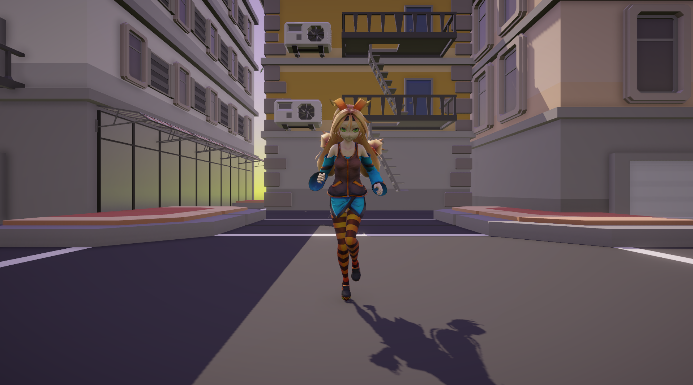

## CustomNRP  

### 基于URP渲染管线，自定义风格

- 支持解包模型和 MMD 模型。
- 支持 Forward 和 Forward+ 渲染路径。
- 支持半透明刘海。
- 支持自阴影和逐物体阴影，同屏最多 16 个。
- 定制的 Bloom 和 Tonemapping。
- 定制的材质编辑器。
- 自动化流程（平滑模型法线、设置贴图、生成材质、构建），集成 Unity Preset 系统。  

### 效果图  

- 使用Toon资源  

   

